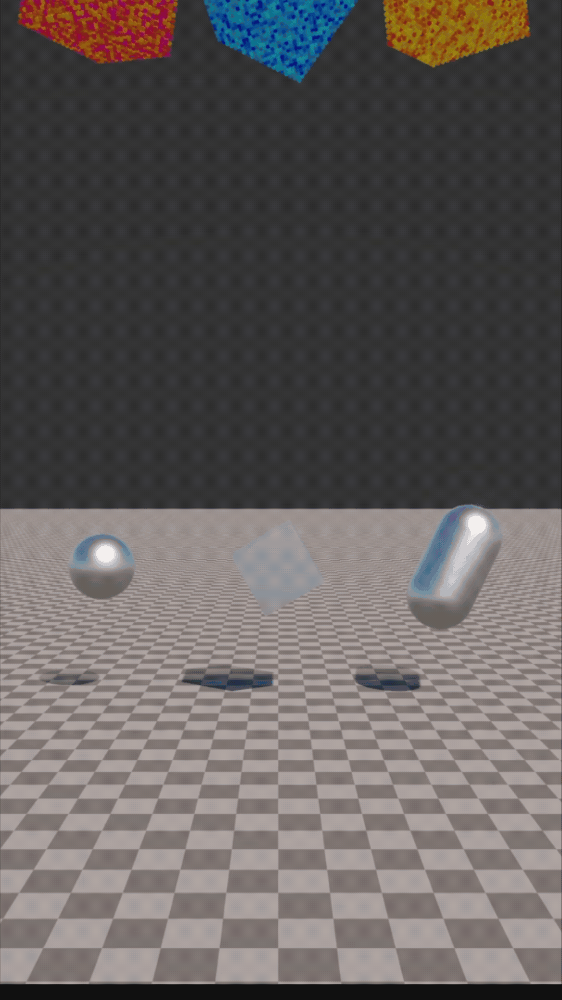
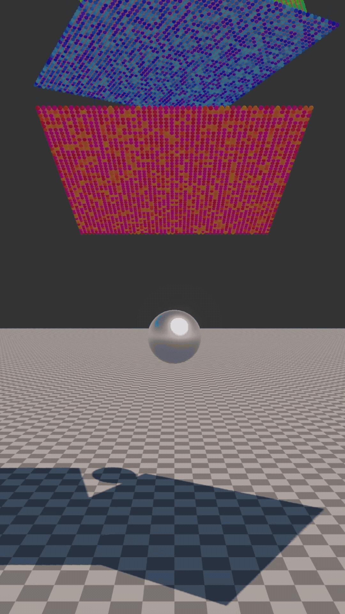

# Unified Solver

A GPU-based unified particle solver for Unity, inspired by Macklin et al. 2014 (*Unified Particle Physics for Real-Time Applications*) and Macklin et al. 2019 (*Small Steps in Physics Simulation*).

All particle types — soft bodies, cloth, ropes, rigid bodies, fluids — share a single solver pipeline: predict, solve constraints, update velocities. The entire simulation runs on the GPU via compute shaders using XPBD with the Small Steps approach (n substeps, 1 iteration each).

## Features

- **XPBD Distance Constraints** — structural, shear, and bend constraints with configurable compliance, damping, and breakable force thresholds
- **Particle-Particle Collision** — spatial hash based broadphase, Coulomb friction model (static + kinetic), max depenetration speed clamping
- **Phase System** — per-body collision filtering (Flex paper section 3/5). Particles sharing the same phase skip mutual collision
- **World Colliders** — sphere, capsule, and oriented box colliders with friction
- **Cloth Simulation** — procedural grid generator with structural + shear constraints, GPU-driven mesh rendering (vertex shader reads from particle buffer, no readback)
- **Cube Generator** — 3D particle grids with full constraint wiring (structural, shear, volume diagonals)
- **GPU Instanced Rendering** — particles rendered as instanced spheres directly from the compute buffer
- **Successive Over-Relaxation** — SOR factor for faster constraint convergence (Flex paper Eq. 13)
- **Parallel Jacobi Solver** — fixed-point atomic accumulation for lock-free parallel constraint solving

## Demos

<p>
  
  
</p>

## Architecture

```
SolverManager (singleton, orchestrator)
  |-- Compute Shader: UnifiedSolver.compute
  |     Kernels: Predict, ClearDeltas, SolveDistance, SolveContact,
  |              ApplyDeltas, SolveGround, SolveSphere, SolveCapsule,
  |              SolveBox, UpdateVelocity, ClearHash, BuildHash
  |
  |-- Generators: CubeGenerator, ClothGenerator
  |-- Colliders: SolverSphereCollider, SolverCapsuleCollider, SolverBoxCollider
  |-- Rendering: ParticleRenderer, ConstraintRenderer, ClothRenderer (shader)
  |-- Utility: PhaseManager, SolverData
```

## Setup

1. Place the `unified-solver` folder in `Assets/`
2. Create a GameObject with `SolverManager` and assign the `UnifiedSolver` compute shader
3. Add generators (CubeGenerator, ClothGenerator) or spawn particles via the `SolverManager.AddParticle()` API
4. Add a `ParticleRenderer` with the particle material for sphere visualization
5. Add a `ConstraintRenderer` with the constraint material for constraint visualization
6. For cloth: assign a material using the `UnifiedSolver/ClothRenderer` shader

## Roadmap

> **Note:** The features listed below are **not yet implemented**. They represent planned future development milestones.

### v0.3 — Cloth & Ropes

- **RopeBody** — chain of n particles with distance constraints between neighbors, configurable length, segment count, and fixed endpoints

No compute shader changes required — cloth and ropes use existing distance constraints + particle collision.

### v0.4 — Shape Matching & Rigid Bodies

- **SolveShapeMatch kernel** — shape matching constraint (Flex paper Eq. 15-16), covariance matrix + polar decomposition per shape, stiffness parameter (1.0 = rigid, <1.0 = deformable)
- **SoftBody** — voxelized mesh with distance constraints + shape matching (stiffness < 1)
- **RigidParticleBody** — voxelized mesh with shape matching (stiffness = 1), SDF values per particle for collision normals (Flex paper section 5.1)

### v0.5 — Fluids

- **SolveDensity kernel** — position-based fluids density constraint (Macklin & Mueller 2013, Flex paper Eq. 26-27), SPH kernels (Poly6 + Spiky), unilateral separation only
- **FluidEmitter** — spawns particles with fluid phase and configurable rest density
- **FluidRenderer** — screen-space ellipsoid splatting

## References

- Macklin, M. et al. (2014). *Unified Particle Physics for Real-Time Applications*.
- Macklin, M. et al. (2019). *Small Steps in Physics Simulation*.
- Macklin, M. & Mueller, M. (2013). *Position Based Fluids*.
